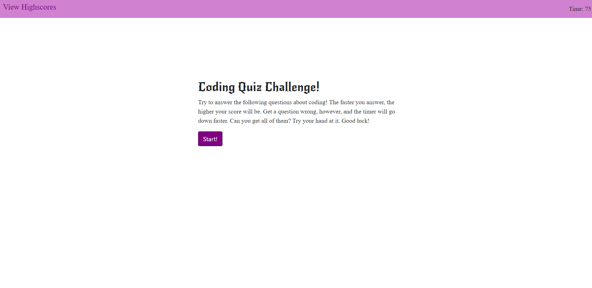
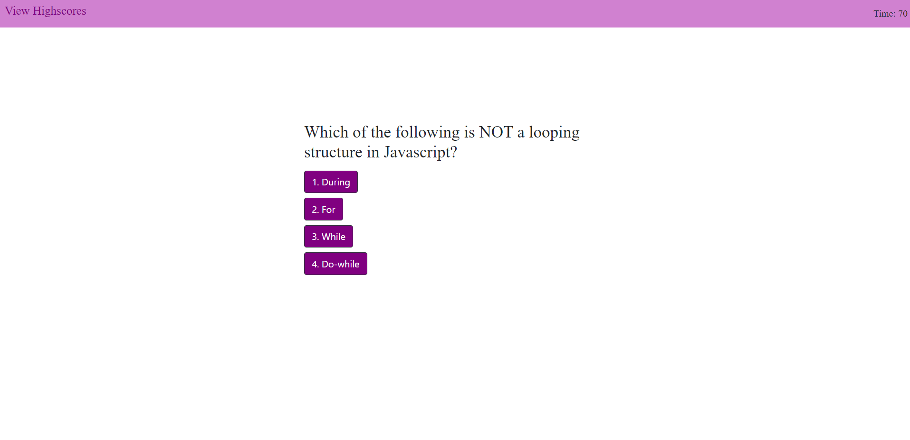
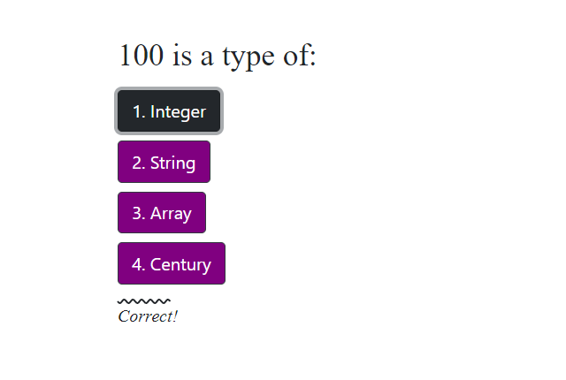
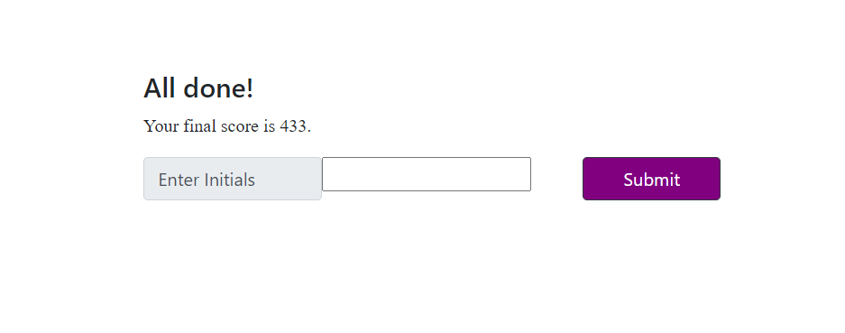

# 04 Coding Quiz Application

Want to challenge your Javascript knowledge and see how you compare to your fellow classmates? Try your hand at this coding quiz application!  

#### Deployed Link: https://hanlee-311.github.io/code-quiz/

## Description
Ten questions are presented to you to challenge your Javascript know-how, and you will have 75 seconds to answer them all. Get a question right, and your score will increase! The quicker you answer, the higher your score will be. Get a question wrong, however, and the timer will lose time, and you will not earn more points. 

When you click on the answer you think is correct, the application will let you know if you got it right or wrong, before moving onto the next question. 

Once you have completed the quiz, you will be able to save your initials and high scores for all to see! (But don't worry, if you find yourself embarrased by your score, you can always erase the highscore history!)

## Functions of Code Quiz
- User will be presented with ten questions to answer in 75 seconds. 
- If the user completes the quiz in time or the timer runs out, the quiz ends. 
- If the user gets a question correct, their score goes up and the quiz will let them know they got it right.
- If the user gets a question wrong, the timer will lose time and the quiz will let them know they got it wrong. 
- When the quiz ends, the user will be able to see their score and enter their initials. 
- When they enter their initials and click submit, their high score will be saved and presented on the View Highscore page. 
- The user can erase the highscore history.

